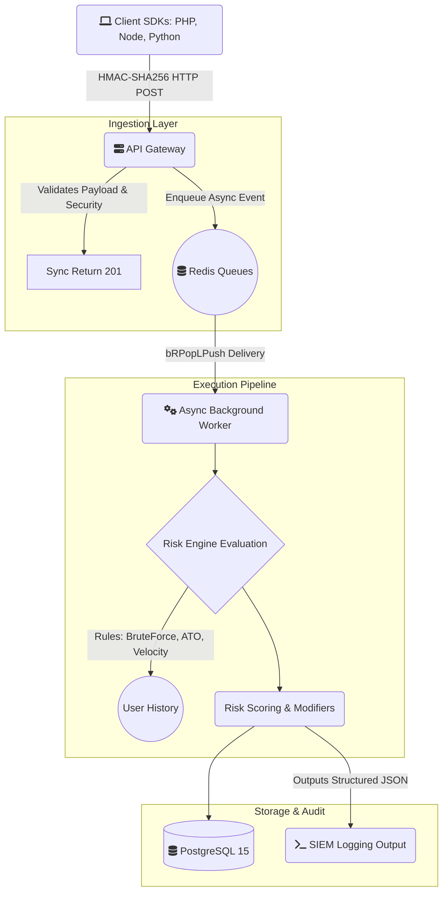

<!-- Improved compatibility of back to top link: See: https://github.com/othneildrew/Best-README-Template/pull/73 -->
<a id="readme-top"></a>

<!-- PROJECT SHIELDS -->
[![Contributors][contributors-shield]][contributors-url]
[![Forks][forks-shield]][forks-url]
[![Stargazers][stars-shield]][stars-url]
[![Issues][issues-shield]][issues-url]
[![MIT License][license-shield]][license-url]
[![LinkedIn][linkedin-shield]][linkedin-url]

<!-- PROJECT LOGO -->
<br />
<div align="center">

<h3 align="center">Sentinel</h3>

  <p align="center">
    <strong>Self-hosted security monitoring framework for web applications.</strong><br>
    Event tracking, threat detection, and risk scoring — all from a single lightweight PHP/PostgreSQL application.
    <br />
    <a href="https://github.com/MuzakirLone/Sentinel"><strong>Explore the docs »</strong></a>
    <br />
    <br />
    <a href="https://github.com/MuzakirLone/Sentinel/issues/new?labels=bug&template=bug-report---.md">Report Bug</a>
    &middot;
    <a href="https://github.com/MuzakirLone/Sentinel/issues/new?labels=enhancement&template=feature-request---.md">Request Feature</a>
  </p>
</div>

<!-- TABLE OF CONTENTS -->
<details>
  <summary>Table of Contents</summary>
  <ol>
    <li>
      <a href="#about-the-project">About The Project</a>
      <ul>
        <li><a href="#core-features">Core Features</a></li>
        <li><a href="#built-with">Built With</a></li>
      </ul>
    </li>
    <li>
      <a href="#getting-started">Getting Started</a>
      <ul>
        <li><a href="#prerequisites">Prerequisites</a></li>
        <li><a href="#installation">Installation</a></li>
      </ul>
    </li>
    <li><a href="#usage">Usage</a>
      <ul>
        <li><a href="#api-usage">API Usage</a></li>
        <li><a href="#sdk-integration">SDK Integration</a></li>
        <li><a href="#preset-detection-rules">Preset Detection Rules</a></li>
        <li><a href="#security--reliability-features">Security & Reliability Features</a></li>
        <li><a href="#architecture-decision-records">Architecture Decision Records</a></li>
        <li><a href="#architecture">Architecture</a></li>
        <li><a href="#attack-simulations">Attack Simulations</a></li>
      </ul>
    </li>
    <li><a href="#contributing">Contributing</a></li>
    <li><a href="#license">License</a></li>
    <li><a href="#contact">Contact</a></li>
    <li><a href="#acknowledgments">Acknowledgments</a></li>
  </ol>
</details>

<!-- ABOUT THE PROJECT -->
## About The Project

**Sentinel** is an enterprise-grade, self-hosted security framework engineered to **monitor, detect, and protect** web applications organically from threats, fraud, and account abuse in real-time.

Built as a significant advancement over existing security monitoring solutions, Sentinel was designed from the ground up to demonstrate and test modern, production-ready engineering practices. It bridges the gap between theoretical security concepts and practical software architecture by implementing advanced enterprise capabilities. These include exactly-once idempotent queue processing, native SIEM observability layers, strict multi-staged Docker immutability workloads, and comprehensive automated CI/CD DevOps testing pipelines.

After a quick Docker-based installation, the system is ready to ingest high-volume events through scalable API calls, providing immediate analytical visibility through a **real-time threat dashboard**.

<p align="right">(<a href="#readme-top">back to top</a>)</p>

### Core Features

| Feature | Description |
| ------- | ----------- |
| 🔌 **SDKs & API** | Send events from any application with PHP, Python, and Node.js SDKs |
| 📊 **Real-time Dashboard** | Monitor security events from a premium dark-mode interface |
| 👤 **Single User View** | Analyze behavior patterns, risk scores, and activity timelines |
| ⚙️ **Rule Engine** | Auto-calculate risk scores with 10 preset rules or create your own |
| 📋 **Review Queue** | Auto-suspend accounts or flag them for manual review |
| 📝 **Field Audit Trail** | Track field modifications — what changed, when, and by whom |
| 🔍 **Blacklist API** | Real-time check endpoint for blocking malicious actors |

<p align="right">(<a href="#readme-top">back to top</a>)</p>

### Built With

* [![PHP][PHP.com]][PHP-url]
* [![PostgreSQL][PostgreSQL.com]][PostgreSQL-url]
* [![Redis][Redis.com]][Redis-url]
* [![Docker][Docker.com]][Docker-url]
* [![Chart.js][Chart.js]][Chart-url]
* [![Python][Python.com]][Python-url]

<p align="right">(<a href="#readme-top">back to top</a>)</p>

<!-- GETTING STARTED -->
## Getting Started

### Prerequisites

| Component | Minimum | Recommended |
| --------- | ------- | ----------- |
| PostgreSQL | 512 MB RAM | 4 GB RAM |
| Application | 128 MB RAM | 1 GB RAM |
| Storage | ~3 GB per 1M events | — |

For manual installation, you will also need:
* PHP 8.1+ with extensions: `PDO_PGSQL`, `cURL`
* PostgreSQL 12+
* Apache with `mod_rewrite` and `mod_headers`

### Installation

#### Docker (Recommended)

**Development Build (Hot-Reloading):**

```bash
git clone https://github.com/MuzakirLone/Sentinel.git
cd Sentinel

# Start development services
docker-compose up -d

# Navigate to http://localhost:8585/signup to configure Admin
```

**Production Build (Immutable Deployments):**

```bash
# Production strictly prevents local file mapping for supreme security isolation
docker-compose -f docker-compose.prod.yml up --build -d
```

#### Manual Installation

1. Clone repository to your web server root
2. Import the database schema:
   ```bash
   psql -U sentinel -d sentinel -f database/migrations/001_initial_schema.sql
   ```
3. Copy and configure environment:
   ```bash
   cp .env.example .env
   # Edit .env with your database credentials
   ```
4. Navigate to `http://your-server/signup` to create an admin account
5. Set up the cron job (every 10 minutes):
   ```bash
   */10 * * * * /usr/bin/php /path/to/sentinel/index.php /cron
   ```

<p align="right">(<a href="#readme-top">back to top</a>)</p>

<!-- USAGE EXAMPLES -->
## Usage

### API Usage

**Sending Events**

```bash
curl -X POST http://localhost:8585/api/v1/events \
  -H "Content-Type: application/json" \
  -H "X-API-Key: sk_your_api_key" \
  -d '{
    "event_type": "login_success",
    "user_id": "usr_12345",
    "email": "user@example.com",
    "ip": "203.0.113.42",
    "user_agent": "Mozilla/5.0..."
  }'
```

**Blacklist Check**

```bash
curl -X POST http://localhost:8585/api/v1/blacklist/check \
  -H "Content-Type: application/json" \
  -H "X-API-Key: sk_your_api_key" \
  -d '{"user_id": "usr_12345", "ip": "203.0.113.42"}'
```

See [API.md](API.md) for complete API documentation.

<p align="right">(<a href="#readme-top">back to top</a>)</p>

### SDK Integration

**PHP**
```php
$sentinel = new SentinelTracker('http://localhost:8585', 'sk_your_api_key');
$sentinel->trackLogin('usr_12345', true, ['email' => 'user@example.com']);
```

**Python**
```python
from sentinel_tracker import SentinelTracker
tracker = SentinelTracker("http://localhost:8585", "sk_your_api_key")
tracker.track_login("usr_12345", success=True, email="user@example.com")
```

**Node.js**
```javascript
const SentinelTracker = require('./sentinel-tracker');
const tracker = new SentinelTracker('http://localhost:8585', 'sk_your_api_key');
await tracker.trackLogin('usr_12345', true, { email: 'user@example.com' });
```

See `sdks/` for complete SDK documentation with framework integration guides.

<p align="right">(<a href="#readme-top">back to top</a>)</p>

### Preset Detection Rules

| Rule | Category |
| ---- | -------- |
| Account Takeover | Authentication |
| Credential Stuffing | Authentication |
| Brute Force | Authentication |
| Bot Detection | Automation |
| Content Spam | Content |
| Multi-Accounting | Identity |
| Dormant Account | Behavior |
| High-Risk Region | Geography |
| Promo Abuse | Fraud |
| Insider Threat | Access Control |

Each rule uses advanced behavioral analysis:
- **Exponential Decay Scoring** — Recent events weigh more than older ones
- **Statistical Baselines** — User's normal behavior informs anomaly detection
- **Compound Signal Aggregation** — Multiple weak signals combine into strong detection
- **Confidence Scoring** — New users with few events get lower confidence to reduce false positives
- **Impossible Travel Detection** — Haversine distance + velocity calculation between login locations
- **Request Timing Entropy** — Standard deviation of request intervals detects bot-like regularity

<p align="right">(<a href="#readme-top">back to top</a>)</p>

### Security & Reliability Features

Sentinel is built identically to modern enterprise infrastructure:
- **Zero-Loss Background Queuing:** Background evaluations execute on fault-tolerant `BRPOPLPUSH` native Redis queuing mechanisms.
- **Idempotency Standards:** Sentinel safely ingests identical payloads automatically recognizing and ignoring cryptographic duplicate anomalies without taxing database execution engines.
- **HMAC Request Validation:** Ingestion accepts cryptographic `X-Signature`, defending the application comprehensively against replay attacks and body payload tampering.
- **Strict Fallback Hooks:** Critical environment validations are deployed immediately during framework boot. Omitted configuration secrets naturally crash the application ensuring no unsafe unencrypted instances silently linger online.
- **Structured Telemetry (JSON):** The Core application explicitly natively surfaces logging utilizing comprehensive SIEM-parsable JSON standard outputs appending Correlation Trace IDs automatically allowing absolute interaction tracking.

<p align="right">(<a href="#readme-top">back to top</a>)</p>

### Architecture Decision Records

**Why PHP?**
Deliberate choice — not a limitation:
1. **Domain Alignment**: Tirreno (the upstream project Sentinel forks from) is PHP. Security monitoring tools are often PHP because PHP powers 77% of server-side web, making it the lowest deployment barrier for self-hosted security tools.
2. **Runtime Properties**: PHP's share-nothing request model is inherently resistant to memory leaks in long-running monitoring — each request is isolated. Combined with Redis for async processing, this gives both reliability and throughput.
3. **The Code Speaks**: The implementation demonstrates real security engineering — behavioral baselines, Haversine distance calculations, HMAC-SHA256 signing, exponential decay functions, and statistical analysis.

**HMAC-SHA256 API Signing**
Beyond simple API key authentication, Sentinel supports cryptographic request verification:
- `signature = HMAC-SHA256(api_secret, timestamp + "\n" + method + "\n" + path + "\n" + body_sha256)`
- Prevents replay attacks (timestamp drift > 5min rejected)
- Prevents man-in-the-middle tampering (body hash verified)
- Backward compatible — falls back to plain API key when no signature present

**Redis Queue Architecture**
For high-throughput deployments, Sentinel decouples ingestion from processing:
- `SDK → API → Redis Queue → Worker → DB + Risk Engine`
- API returns `202 Accepted` immediately (sub-10ms latency)
- Background worker processes events with full risk engine evaluation
- Graceful fallback to synchronous mode if Redis is unavailable

<p align="right">(<a href="#readme-top">back to top</a>)</p>

### Architecture



See [ARCHITECTURE.md](ARCHITECTURE.md) for detailed system design.

<p align="right">(<a href="#readme-top">back to top</a>)</p>

### Attack Simulations

Sentinel includes a suite of Python attack simulation scripts that validate detection capabilities against real-world attack patterns:

```bash
cd simulations/
pip install requests

# Brute Force: 40 rapid failed logins → successful compromise
python brute_force.py http://localhost:8585 sk_your_api_key

# Credential Stuffing: 20 stolen credential pairs, ~5% success rate
python credential_stuffing.py http://localhost:8585 sk_your_api_key

# Impossible Travel: Mumbai → Moscow → São Paulo in minutes
python impossible_travel.py http://localhost:8585 sk_your_api_key

# Account Takeover: Baseline → new device login → credential changes → data export
python account_takeover.py http://localhost:8585 sk_your_api_key

# Bot Traffic: Machine-like timing intervals, endpoint hammering
python bot_traffic.py http://localhost:8585 sk_your_api_key
```

Each script shows real-time risk score escalation and triggered rules. See [simulations/README.md](simulations/README.md) for detailed documentation.

<p align="right">(<a href="#readme-top">back to top</a>)</p>

<!-- CONTRIBUTING -->
## Contributing

Contributions are what make the open source community such an amazing place to learn, inspire, and create. Any contributions you make are **greatly appreciated**.

See [CONTRIBUTING.md](CONTRIBUTING.md) for guidelines.

1. Fork the Project
2. Create your Feature Branch (`git checkout -b feature/AmazingFeature`)
3. Commit your Changes (`git commit -m 'Add some AmazingFeature'`)
4. Push to the Branch (`git push origin feature/AmazingFeature`)
5. Open a Pull Request

<p align="right">(<a href="#readme-top">back to top</a>)</p>

<!-- LICENSE -->
## License

Distributed under the MIT License. See `LICENSE` for more information.

<p align="right">(<a href="#readme-top">back to top</a>)</p>

<!-- CONTACT -->
## Contact

Muzakir Lone - [@your_twitter](https://twitter.com/your_twitter) - email@example.com

Project Link: [https://github.com/MuzakirLone/Sentinel](https://github.com/MuzakirLone/Sentinel)

<p align="right">(<a href="#readme-top">back to top</a>)</p>

<!-- ACKNOWLEDGMENTS -->
## Acknowledgments

* [Tirreno](https://github.com/Tirreno) (Upstream Architecture Inspiration)
* [Best-README-Template](https://github.com/othneildrew/Best-README-Template)

<p align="right">(<a href="#readme-top">back to top</a>)</p>

<!-- MARKDOWN LINKS & IMAGES -->
[contributors-shield]: https://img.shields.io/github/contributors/MuzakirLone/Sentinel.svg?style=for-the-badge
[contributors-url]: https://github.com/MuzakirLone/Sentinel/graphs/contributors
[forks-shield]: https://img.shields.io/github/forks/MuzakirLone/Sentinel.svg?style=for-the-badge
[forks-url]: https://github.com/MuzakirLone/Sentinel/network/members
[stars-shield]: https://img.shields.io/github/stars/MuzakirLone/Sentinel.svg?style=for-the-badge
[stars-url]: https://github.com/MuzakirLone/Sentinel/stargazers
[issues-shield]: https://img.shields.io/github/issues/MuzakirLone/Sentinel.svg?style=for-the-badge
[issues-url]: https://github.com/MuzakirLone/Sentinel/issues
[license-shield]: https://img.shields.io/github/license/MuzakirLone/Sentinel.svg?style=for-the-badge
[license-url]: https://github.com/MuzakirLone/Sentinel/blob/master/LICENSE
[linkedin-shield]: https://img.shields.io/badge/-LinkedIn-black.svg?style=for-the-badge&logo=linkedin&colorB=555
[linkedin-url]: https://linkedin.com/in/your_linkedin

[PHP.com]: https://img.shields.io/badge/PHP-8892BF?style=for-the-badge&logo=php&logoColor=white
[PHP-url]: https://php.net/
[PostgreSQL.com]: https://img.shields.io/badge/PostgreSQL-316192?style=for-the-badge&logo=postgresql&logoColor=white
[PostgreSQL-url]: https://postgresql.org/
[Docker.com]: https://img.shields.io/badge/Docker-2496ED?style=for-the-badge&logo=docker&logoColor=white
[Docker-url]: https://docker.com/
[Redis.com]: https://img.shields.io/badge/Redis-DC382D?style=for-the-badge&logo=redis&logoColor=white
[Redis-url]: https://redis.io/
[Chart.js]: https://img.shields.io/badge/Chart.js-FF6384?style=for-the-badge&logo=chartdotjs&logoColor=white
[Chart-url]: https://www.chartjs.org/
[Python.com]: https://img.shields.io/badge/Python-3776AB?style=for-the-badge&logo=python&logoColor=white
[Python-url]: https://python.org/
