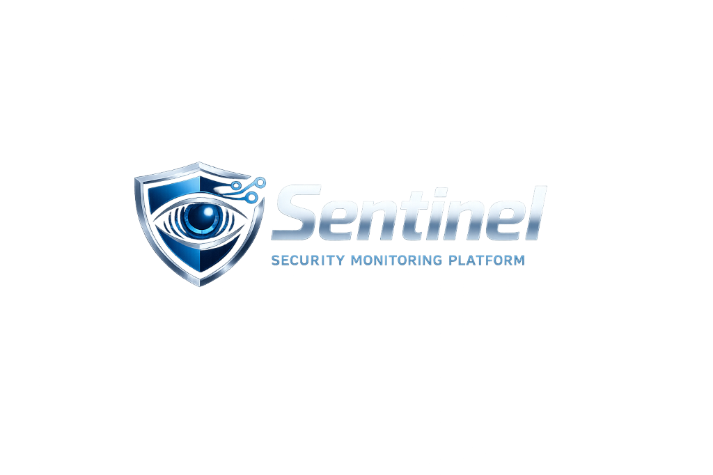
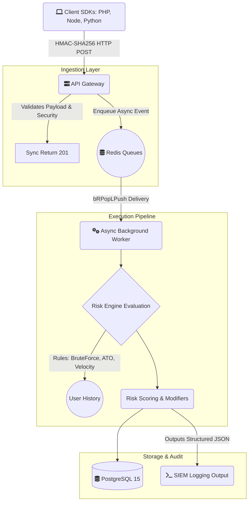

# Sentinel

<div align="center">
  
</div>

**Self-hosted security monitoring framework for web applications.**
Event tracking, threat detection, and risk scoring — all from a single lightweight PHP/PostgreSQL application.

[](https://php.net)
[](https://postgresql.org)
[](LICENSE)
[](docker-compose.yml)

---

<details>
  <summary><b>Table of Contents</b></summary>
  <ul>
    <li><a href="#what-is-sentinel">What is Sentinel?</a></li>
    <li><a href="#core-features">Core Features</a></li>
    <li><a href="#preset-detection-rules">Preset Detection Rules</a></li>
    <li><a href="#security--reliability-features">Security & Reliability Features</a></li>
    <li><a href="#architecture-decision-records">Architecture Decision Records</a></li>
    <li><a href="#quick-start">Quick Start</a></li>
    <li><a href="#api-usage">API Usage</a></li>
    <li><a href="#sdk-integration">SDK Integration</a></li>
    <li><a href="#architecture">Architecture</a></li>
    <li><a href="#attack-simulations">Attack Simulations</a></li>
    <li><a href="#resource-requirements">Resource Requirements</a></li>
    <li><a href="#contributing">Contributing</a></li>
    <li><a href="#license">License</a></li>
    <li><a href="#built-with">Built With</a></li>
  </ul>
</details>

---

<a id="what-is-sentinel"></a>
## 🛡 What is Sentinel?

Sentinel is an enterprise-grade, self-hosted security framework engineered to **monitor, detect, and protect** web applications organically from threats, fraud, and account abuse in real-time.

Built as a significant advancement over existing security monitoring solutions, Sentinel was designed from the ground up to demonstrate and test modern, production-ready engineering practices. It bridges the gap between theoretical security concepts and practical software architecture by implementing advanced enterprise capabilities. These include exactly-once idempotent queue processing, native SIEM observability layers, strict multi-staged Docker immutability workloads, and comprehensive automated CI/CD DevOps testing pipelines.

After a quick Docker-based installation, the system is ready to ingest high-volume events through scalable API calls, providing immediate analytical visibility through a **real-time threat dashboard**.

---

<a id="core-features"></a>
## ✨ Core Features

| Feature | Description |
| ------- | ----------- |
| 🔌 **SDKs & API** | Send events from any application with PHP, Python, and Node.js SDKs |
| 📊 **Real-time Dashboard** | Monitor security events from a premium dark-mode interface |
| 👤 **Single User View** | Analyze behavior patterns, risk scores, and activity timelines |
| ⚙️ **Rule Engine** | Auto-calculate risk scores with 10 preset rules or create your own |
| 🚨 **Alert Queue** | Triage high-risk detections and escalate to cases |
| 🗂 **Case Management** | Track investigations, SLA deadlines, and resolution notes |
| 📝 **Field Audit Trail** | Track field modifications — what changed, when, and by whom |
| 🔍 **Blacklist API** | Real-time check endpoint for blocking malicious actors |
| 🔗 **Integrations** | Connect to SIEMs, chat, and ticketing workflows |

---

<a id="preset-detection-rules"></a>
## 🎯 Preset Detection Rules

| Rule | Category |
| ---- | -------- |
| Account Takeover | Authentication |
| Credential Stuffing | Authentication |
| Brute Force | Authentication |
| Bot Detection | Automation |
| Content Spam | Content |
| Multi-Accounting | Identity |
| Dormant Account | Behavior |
| High-Risk Region | Geography |
| Promo Abuse | Fraud |
| Insider Threat | Access Control |

Each rule uses advanced behavioral analysis:

- **Exponential Decay Scoring** — Recent events weigh more than older ones
- **Statistical Baselines** — User's normal behavior informs anomaly detection
- **Compound Signal Aggregation** — Multiple weak signals combine into strong detection
- **Confidence Scoring** — New users with few events get lower confidence to reduce false positives
- **Impossible Travel Detection** — Haversine distance + velocity calculation between login locations
- **Request Timing Entropy** — Standard deviation of request intervals detects bot-like regularity

Rule configuration now includes **MITRE ATT&CK mappings** directly in the Rules dashboard to align detections with common adversary techniques.

---

<a id="security--reliability-features"></a>
## 🔒 Security & Reliability Features

Sentinel is built identically to modern enterprise infrastructure:

- **Zero-Loss Background Queuing:** Background evaluations execute on fault-tolerant `BRPOPLPUSH` native Redis queuing mechanisms.
- **Idempotency Standards:** Sentinel safely ingests identical payloads automatically recognizing and ignoring cryptographic duplicate anomalies without taxing database execution engines.
- **HMAC Request Validation:** Ingestion accepts cryptographic `X-Signature`, defending the application comprehensively against replay attacks and body payload tampering.
- **Strict Fallback Hooks:** Critical environment validations are deployed immediately during framework boot. Omitted configuration secrets naturally crash the application ensuring no unsafe unencrypted instances silently linger online.
- **Structured Telemetry (JSON):** The Core application explicitly natively surfaces logging utilizing comprehensive SIEM-parsable JSON standard outputs appending Correlation Trace IDs automatically allowing absolute interaction tracking.

---

<a id="architecture-decision-records"></a>
## 🧠 Architecture Decision Records

### Why PHP?

Deliberate choice — not a limitation:

1. **Domain Alignment**: Tirreno (the upstream project Sentinel forks from) is PHP. Security monitoring tools are often PHP because PHP powers 77% of server-side web, making it the lowest deployment barrier for self-hosted security tools.
2. **Runtime Properties**: PHP's share-nothing request model is inherently resistant to memory leaks in long-running monitoring — each request is isolated. Combined with Redis for async processing, this gives both reliability and throughput.
3. **The Code Speaks**: The implementation demonstrates real security engineering — behavioral baselines, Haversine distance calculations, HMAC-SHA256 signing, exponential decay functions, and statistical analysis. The language is the delivery vehicle; the algorithms are the product.

### HMAC-SHA256 API Signing

Beyond simple API key authentication, Sentinel supports cryptographic request verification:

- `signature = HMAC-SHA256(api_secret, timestamp + "\n" + method + "\n" + path + "\n" + body_sha256)`
- Prevents replay attacks (timestamp drift > 5min rejected)
- Prevents man-in-the-middle tampering (body hash verified)
- Backward compatible — falls back to plain API key when no signature present

### Redis Queue Architecture

For high-throughput deployments, Sentinel decouples ingestion from processing:

- `SDK → API → Redis Queue → Worker → DB + Risk Engine`
- API returns `202 Accepted` immediately (sub-10ms latency)
- Background worker processes events with full risk engine evaluation
- Graceful fallback to synchronous mode if Redis is unavailable

---

<a id="quick-start"></a>
## 🚀 Quick Start

### Docker (Recommended)

**Development Build (Hot-Reloading):**

```bash
git clone https://github.com/MuzakirLone/sentinel.git
cd sentinel

# Start development services
docker-compose up -d

# Configure Admin acess at
http://localhost:8585/signup
```

**Production Build (Immutable Deployments):**

```bash
# Production strictly prevents local file mapping for supreme security isolation
docker-compose -f docker-compose.prod.yml up --build -d
```

### Manual Installation

**Requirements:**

- PHP 8.1+ with extensions: `PDO_PGSQL`, `cURL`
- PostgreSQL 12+
- Apache with `mod_rewrite` and `mod_headers`

**Steps:**

1. Clone repository to your web server root
2. Import the database schema:

   ```bash
   psql -U sentinel -d sentinel -f database/migrations/001_initial_schema.sql
   ```

3. Copy and configure environment:

   ```bash
   cp .env.example .env
   # Edit .env with your database credentials
   ```

4. Navigate to `http://your-server/signup` to create an admin account
5. Set up the cron job (every 10 minutes):

   ```bash
   */10 * * * * /usr/bin/php /path/to/sentinel/index.php /cron
   ```

---

<a id="api-usage"></a>
## 📡 API Usage

### Sending Events

```bash
curl -X POST http://localhost:8585/api/v1/events \
  -H "Content-Type: application/json" \
  -H "X-API-Key: sk_your_api_key" \
  -d '{
    "event_type": "login_success",
    "user_id": "usr_12345",
    "email": "user@example.com",
    "ip": "203.0.113.42",
    "user_agent": "Mozilla/5.0..."
  }'
```

### Response

```json
{
  "status": "accepted",
  "event_id": 42,
  "risk_score": 78.3,
  "risk_level": "high",
  "confidence": 85,
  "deviation_score": 45.0,
  "risk_factors": [
    {
      "rule": "account_takeover",
      "score": 40,
      "reason": "Potential account takeover detected",
      "details": [
        "Login from new device + new IP + new country (compound novelty: 40/40)",
        "5 failed logins preceded this successful login (penalty: +25)"
      ]
    },
    {
      "rule": "high_risk_region",
      "score": 35,
      "reason": "Geographical anomaly detected",
      "details": [
        "IMPOSSIBLE TRAVEL: IN→RU (4,716 km in 5.0 min = 56,592 km/h, max plausible: 900 km/h)"
      ]
    }
  ],
  "rules_triggered": ["account_takeover", "high_risk_region"]
}
```

### Blacklist Check (`/signup`)

```bash
curl -X POST http://localhost:8585/api/v1/blacklist/check \
  -H "Content-Type: application/json" \
  -H "X-API-Key: sk_your_api_key" \
  -d '{"user_id": "usr_12345", "ip": "203.0.113.42"}'
```

See [API.md](API.md) for complete API documentation.

---

<a id="sdk-integration"></a>
## 🔧 SDK Integration

### PHP

```php
$sentinel = new SentinelTracker('http://localhost:8585', 'sk_your_api_key');
$sentinel->trackLogin('usr_12345', true, ['email' => 'user@example.com']);
```

### Python

```python
from sentinel_tracker import SentinelTracker
tracker = SentinelTracker("http://localhost:8585", "sk_your_api_key")
tracker.track_login("usr_12345", success=True, email="user@example.com")
```

### Node.js

```javascript
const SentinelTracker = require('./sentinel-tracker');
const tracker = new SentinelTracker('http://localhost:8585', 'sk_your_api_key');
await tracker.trackLogin('usr_12345', true, { email: 'user@example.com' });
```

See `sdks/` for complete SDK documentation with framework integration guides.

---

<a id="architecture"></a>
## 🏗 Architecture



See [ARCHITECTURE.md](ARCHITECTURE.md) for detailed system design.

---

<a id="attack-simulations"></a>
## 🔬 Attack Simulations

Sentinel includes a suite of Python attack simulation scripts that validate detection capabilities against real-world attack patterns:

```bash
cd simulations/
pip install requests

# Brute Force: 40 rapid failed logins → successful compromise
python brute_force.py http://localhost:8585 sk_your_api_key

# Credential Stuffing: 20 stolen credential pairs, ~5% success rate
python credential_stuffing.py http://localhost:8585 sk_your_api_key

# Impossible Travel: Mumbai → Moscow → São Paulo in minutes
python impossible_travel.py http://localhost:8585 sk_your_api_key

# Account Takeover: Baseline → new device login → credential changes → data export
python account_takeover.py http://localhost:8585 sk_your_api_key

# Bot Traffic: Machine-like timing intervals, endpoint hammering
python bot_traffic.py http://localhost:8585 sk_your_api_key
```

Each script shows real-time risk score escalation and triggered rules. See [simulations/README.md](simulations/README.md) for detailed documentation.

---

<a id="resource-requirements"></a>
## 📋 Resource Requirements

| Component | Minimum | Recommended |
| --------- | ------- | ----------- |
| PostgreSQL | 512 MB RAM | 4 GB RAM |
| Application | 128 MB RAM | 1 GB RAM |
| Storage | ~3 GB per 1M events | — |

---

<a id="contributing"></a>
## 🤝 Contributing

Contributions are welcome! See [CONTRIBUTING.md](CONTRIBUTING.md) for guidelines.

---

<a id="license"></a>
## 📄 License

MIT License. See [LICENSE](LICENSE) for details.

---

<a id="built-with"></a>
## 🔗 Built With

- **PHP 8.1+** — Core application logic & risk engine
- **PostgreSQL 15** — Primary data store with geo-indexed IP data
- **Redis 7** — Event queue for async processing
- **Chart.js** — Dashboard visualizations
- **Vanilla CSS** — Premium dark-mode design system
- **Docker Compose** — Multi-container deployment (app, worker, db, redis)
- **Python** — Attack simulation scripts
